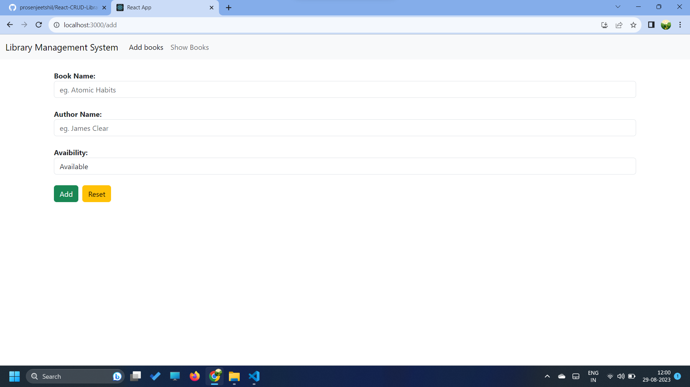
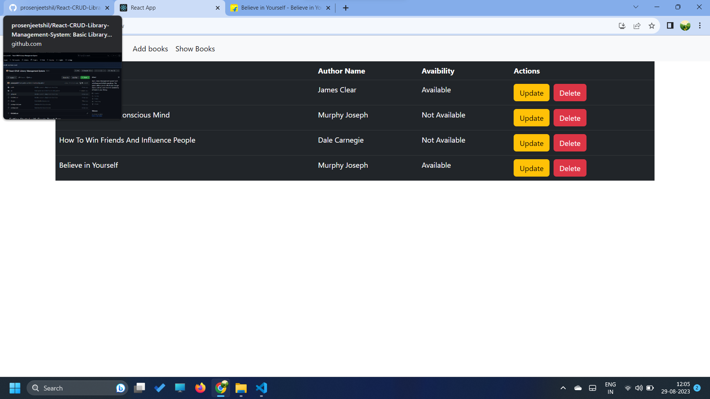
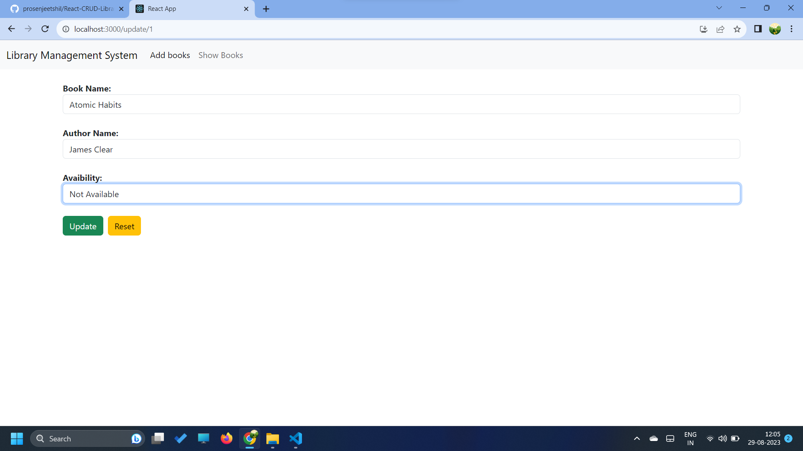
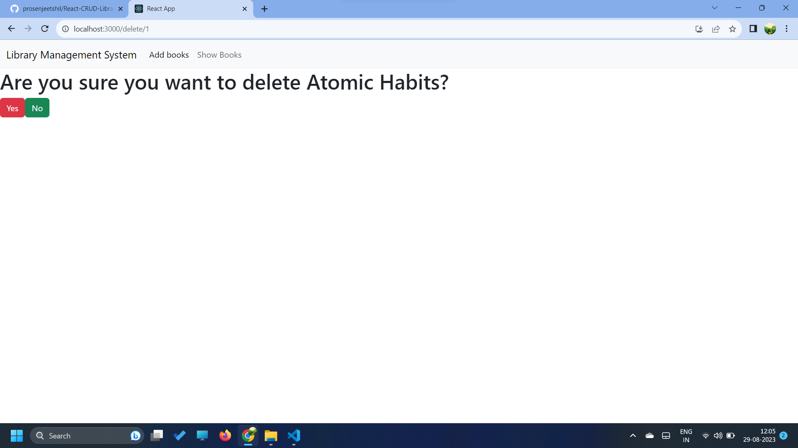

# React CRUD - Library Management System (CRUD only)

## About LMS Project

Basic Library Management System built with React and CRUD operations. This system allows you to effortlessly manage books, authors, and check the availability of books in your library.

## How to start 

Clone the repository, change directories, and use NPM to install the dependencies.

- $ git clone https://github.com/prosenjeetshil/React-CRUD-Library-Management-System.git
- $ cd React-CRUD-Library-Management-System
- $ npm install

- install dependencies with `npm install`
- start with `npm start`

The project can be viewed in the browser at
- [http://localhost:3000](http://localhost:3000)

## Screenshots

